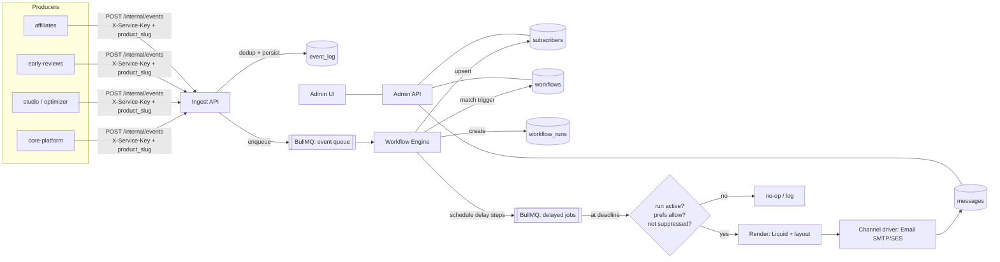
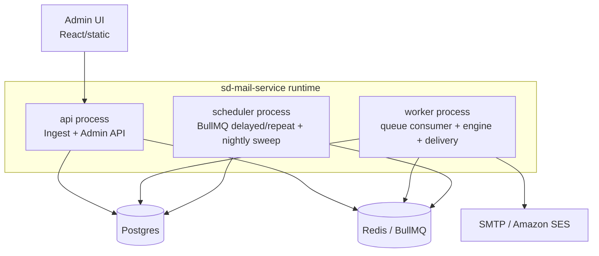

# 02 — Architecture

## Components

sd-mail-service is one codebase deployed as a few process types, backed by Postgres and Redis.

| Component | Responsibility |
|-----------|----------------|
| **Ingest API** | `POST /internal/events` (async, returns 202), provider webhooks. Authenticates the shared service key (`X-Service-Key`), resolves the product from `product_slug`, validates, deduplicates (idempotency), persists to `event_log`, enqueues. |
| **Transactional API** | `POST /internal/messages` — **synchronous** required-mail send: renders a transactional template and delivers inline, returning a delivery result (not 202). Bypasses opt-out/unsubscribe; honors hard bounce. Availability-critical (login/signup depend on it). |
| **Admin API** | CRUD for products, workflows, templates, subscribers, logs. Auth via superadmin sessions (single admin type, full access — no RBAC). |
| **Workflow engine** (worker) | Consumes the event queue: upserts the subscriber, matches workflows by trigger key, creates `workflow_runs`, executes steps, schedules delayed steps, processes cancellations. |
| **Scheduler** | BullMQ delayed/repeatable jobs. Fires delayed steps at their deadline; runs the nightly inactivity sweep. |
| **Delivery / channel drivers** | Renders (Liquid + branded layout) and sends via a channel driver. Email driver (SMTP/SES) first; Slack/in-app/SMS later. Records `messages`, handles retries/DLQ. |
| **Admin UI** | React app for the Admin API. |
| **Postgres** | System of record (schema in [03](03-data-model.md)). |
| **Redis** | BullMQ queues (event, delayed, delivery) + short-lived caches/locks. |

## System diagram

> The diagram above is the **internal** component view. For the **external, actor-level usage lifecycle** (superadmin setup → producer events → cancellation → delivery → end-user engagement), see the [usage diagram](diagrams/usage.mmd), rendered in [08-integration-guide](08-integration-guide.md#usage-at-a-glance).

## Processes & deployment

- **api**, **worker**, **scheduler** are separate entrypoints of the same app (shared models/config), scaled independently. Multiple `worker` replicas are safe (BullMQ locks + idempotent handlers).
- Containerized; CI/CD mirrors the other SalesDuo repos' GitHub Actions. Runs on the same ECS/EC2 + RDS + Redis family as core-platform.
- Config via env: `DATABASE_URL`, `REDIS_URL`, SMTP/SES creds, `ADMIN_*`, signing secrets.

## Request/flow summary

1. **Ingest** — a producer emits an event (shared service key + `product_slug`). API validates, dedups on `idempotency_key`, writes `event_log`, enqueues, returns `202`.
2. **Process** — worker pulls the event, upserts the subscriber, finds matching workflows, and for each spins a `workflow_run` and walks its steps.
3. **Schedule** — `delay` steps become BullMQ delayed jobs (`run_steps` row records the scheduled instance).
4. **Cancel** — a matching `cancel_on` event flips the run to `canceled`; scheduled jobs no-op when they fire.
5. **Send** — at the deadline (or immediately for a leading `send` step), the delivery path checks run status + preferences + suppression, renders, sends via the channel driver, and logs a `message`.

Details of the event contract, step semantics, and state machines are in [04-event-and-workflow-model](04-event-and-workflow-model.md).

## Key design properties

- **Decoupled:** producers only emit events; no callbacks into their systems.
- **Durable:** events and scheduled steps survive restarts (persisted in Postgres; jobs in Redis-backed BullMQ).
- **Idempotent:** dedup at ingest (`idempotency_key`), one active run per (workflow, subscriber, trigger), one `message` per send.
- **Admin-controlled:** workflow timing/conditions and template content are data, edited in the admin UI with no deploy.
- **Multi-tenant:** every row is scoped to a `product` (named per request via `product_slug`). Producers are trusted first-party services sharing one internal key; admins are superadmins with full access across all products (no admin RBAC).
- **Multi-channel-ready:** delivery is behind a channel-driver interface; email is the only v1 driver.
