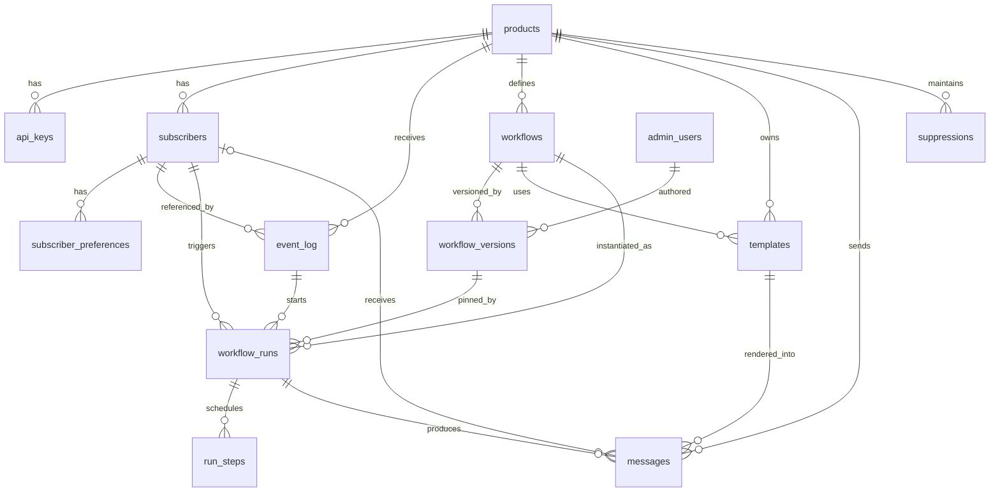

# 03 — Data Model

Postgres is the system of record. Below is the full schema as **dbdiagram.io DBML** (also available standalone at [schema.dbml](schema.dbml)), followed by an equivalent **Mermaid ER diagram** for inline rendering, then per-table notes.

## DBML (paste into [dbdiagram.io](https://dbdiagram.io))

```dbml
Project sd_mail_service {
  database_type: 'PostgreSQL'
  Note: 'Standalone multi-product notification service'
}

Enum channel { email slack in_app sms }
Enum run_status { active canceled completed failed }
Enum message_status { queued sent delivered bounced complained failed suppressed }
Enum step_type { send delay cancel_on repeat }
Enum pref_status { subscribed unsubscribed }
Enum suppression_reason { hard_bounce complaint unsubscribe manual }
Enum message_type { transactional marketing }   // transactional = required mail; bypasses opt-out/unsubscribe (see 11-security)

Table products {
  id uuid [pk]
  slug varchar [unique, not null]          // 'creative-studio', 'core-platform', 'affiliates'
  name varchar [not null]
  brand_name varchar
  brand_color varchar
  logo_url varchar
  from_email varchar [not null]
  reply_to_email varchar
  layout_html text                          // branded wrapper for this product
  created_at timestamp
  updated_at timestamp
}

Table api_keys {
  id uuid [pk]
  product_id uuid [ref: > products.id, not null]
  name varchar
  key_hash varchar [not null]               // store hash only
  last_used_at timestamp
  revoked_at timestamp
  created_at timestamp
}

Table subscribers {
  id uuid [pk]
  product_id uuid [ref: > products.id, not null]
  external_id varchar [not null]            // the product's user id
  email varchar
  name varchar
  attributes jsonb                          // org_id, org_name, role, plan, ...
  timezone varchar
  last_seen_at timestamp                    // drives inactivity
  created_at timestamp
  updated_at timestamp
  Indexes { (product_id, external_id) [unique] }
}

Table subscriber_preferences {
  id uuid [pk]
  subscriber_id uuid [ref: > subscribers.id, not null]
  category varchar [not null]               // 'onboarding','billing','reengagement'
  channel channel [not null]
  status pref_status [not null, default: 'subscribed']
  updated_at timestamp
  Indexes { (subscriber_id, category, channel) [unique] }
}

Table event_log {
  id uuid [pk]
  product_id uuid [ref: > products.id, not null]
  event_key varchar [not null]              // 'creative_studio.trial_started'
  idempotency_key varchar [not null]
  subscriber_id uuid [ref: > subscribers.id]
  occurred_at timestamp
  received_at timestamp
  data jsonb                                // vars: trial_ends_at, upgrade_link, ...
  Indexes { (product_id, idempotency_key) [unique] }
}

Table workflows {
  id uuid [pk]
  product_id uuid [ref: > products.id, not null]
  key varchar [not null]                    // 'no_integration_1d'
  name varchar [not null]
  trigger_event_key varchar [not null]      // 'creative_studio.trial_started'
  category varchar [not null]               // for preference gating
  audience varchar [not null]               // 'event_subscriber' | 'org_owner'
  active_version_id uuid
  enabled boolean [default: true]
  created_at timestamp
  updated_at timestamp
  Indexes { (product_id, key) [unique] }
}

Table workflow_versions {
  id uuid [pk]
  workflow_id uuid [ref: > workflows.id, not null]
  version int [not null]
  steps jsonb [not null]                    // ordered: [{type, ...}]  (send/delay/cancel_on/repeat)
  created_by uuid [ref: > admin_users.id]
  created_at timestamp
  Indexes { (workflow_id, version) [unique] }
}

Table templates {
  id uuid [pk]
  product_id uuid [ref: > products.id, not null]
  key varchar [not null]                    // referenced by a send step's "template"
  type message_type [not null, default: 'marketing']  // transactional templates have workflow_id null
  workflow_id uuid [ref: > workflows.id]
  channel channel [not null, default: 'email']
  subject text                              // Liquid
  body text                                 // Liquid + HTML (body only; layout wraps it)
  cta jsonb                                 // {primary:{label,url}, secondary:{label,url}}
  variables jsonb                           // declared vars for the editor helper
  updated_at timestamp
  Indexes { (product_id, key) [unique] }
}

Table workflow_runs {
  id uuid [pk]
  workflow_id uuid [ref: > workflows.id, not null]
  workflow_version_id uuid [ref: > workflow_versions.id]
  subscriber_id uuid [ref: > subscribers.id, not null]
  trigger_event_id uuid [ref: > event_log.id]
  status run_status [not null, default: 'active']
  cancel_on jsonb                           // event_keys that defuse this run
  created_at timestamp
  completed_at timestamp
  Indexes { (workflow_id, subscriber_id, status) }
}

Table run_steps {
  id uuid [pk]
  run_id uuid [ref: > workflow_runs.id, not null]
  step_index int [not null]
  step_type step_type [not null]
  scheduled_for timestamp                   // for delay steps (BullMQ job time)
  job_id varchar                            // BullMQ delayed job id
  executed_at timestamp
  Indexes { (run_id, step_index) [unique] }
}

Table messages {
  id uuid [pk]
  product_id uuid [ref: > products.id, not null]
  type message_type [not null]              // transactional vs marketing (drives suppression/footer)
  to_email varchar [not null]               // actual recipient; supports raw transactional sends + suppression key
  subscriber_id uuid [ref: > subscribers.id]  // nullable: transactional sends may have no subscriber (e.g. signup OTP)
  run_id uuid [ref: > workflow_runs.id]
  template_id uuid [ref: > templates.id]
  channel channel [not null]
  provider_message_id varchar
  status message_status [not null, default: 'queued']
  error text
  sent_at timestamp
  created_at timestamp
  Indexes { (subscriber_id, created_at) }
}

Table suppressions {
  id uuid [pk]
  product_id uuid [ref: > products.id]
  email varchar [not null]
  reason suppression_reason [not null]
  created_at timestamp
  Indexes { (product_id, email, reason) [unique] }   // one row per reason so hard_bounce coexists with unsubscribe/complaint
}

// Superadmins — full access to all products. No RBAC/roles (single admin type).
Table admin_users {
  id uuid [pk]
  email varchar [unique, not null]
  name varchar
  created_at timestamp
}
```

## ER diagram (Mermaid)



## Table notes

- **products** — one row per consuming platform. Holds branding used by the render layer (`brand_name`, `brand_color`, `logo_url`, `from_email`, `reply_to_email`, `layout_html`). Everything else is scoped by `product_id` → this is the multi-tenant boundary.
- **api_keys** — product-scoped ingestion credentials. Only the **hash** is stored; the plaintext is shown once at creation. Rotation = create new + `revoked_at` the old. Blast radius of a leak is one product.
- **subscribers** — the recipient profile, unique per `(product_id, external_id)`. `external_id` is the product's own user id. `attributes` (JSONB) carries anything workflows/templates need (`org_id`, `org_name`, `role`, `plan`). `last_seen_at` powers inactivity workflows. Email/name are upserted from events so producers can send thin payloads.
- **subscriber_preferences** — per `(category, channel)` opt-in/out, applied to **marketing** messages at **send time** (not schedule time). Absence defaults to `subscribed`. **Transactional** messages skip this check entirely — required mail is never gated by preferences (see [11](11-security-and-compliance.md)).
- **event_log** — append-only record of everything ingested. `(product_id, idempotency_key)` unique = the dedup guarantee. Enables **replay** and audit. `data` holds template variables.
- **workflows** / **workflow_versions** — a workflow is identified by `(product_id, key)`; its behavior lives in a **versioned** `steps` JSON. `active_version_id` points at the live version. Editing produces a new version; in-flight runs pin the version they started on.
- **templates** — content for a `send` step: `subject` + `body` (Liquid + HTML, body only — the product `layout_html` wraps it), `cta` blocks (label + url, primary/secondary), and a `variables` manifest that drives the admin editor's helper + validation. Identified by `key`, unique per `(product_id, key)` — this is the string a `send` step's `template` field resolves against (for the step's `channel`). `type` = `marketing` (workflow-driven, respects preferences/suppression, gets an unsubscribe footer) or `transactional` (required mail sent via the synchronous API, `workflow_id` null, bypasses opt-out/unsubscribe, no footer — see [04](04-event-and-workflow-model.md) and [11](11-security-and-compliance.md)).
- **workflow_runs** — one execution per `(workflow, subscriber, trigger event)`. `status` drives the state machine ([04](04-event-and-workflow-model.md)); `cancel_on` copies the event keys that defuse it. The `(workflow, subscriber, status)` index supports dedup and cancellation lookups.
- **run_steps** — materializes each scheduled step so delayed jobs are queryable/auditable (which sends are pending, when). `job_id` links to the BullMQ job for cancellation.
- **messages** — the delivery log: one per send attempt, with provider id + `status` lifecycle (`queued → sent → delivered | bounced | complained | failed | suppressed`). Powers analytics and idempotency. `type` records the class (transactional/marketing) so the send-time gate and the audit trail know which suppression/footer rules applied. `to_email` is the actual recipient address — always recorded (it's the suppression key and lets **transactional** sends target a raw email); `subscriber_id` is therefore **nullable** (a signup-OTP send has no profile yet).
- **suppressions** — one row per `(product_id, email, reason)` so a single address can carry several reasons at once (e.g. `unsubscribe` **and** `hard_bounce`). The send-time gate is reason-aware: **marketing** is blocked by any reason; **transactional** is blocked **only** by `hard_bounce` (undeliverable), ignoring `unsubscribe`/`complaint`/`manual`. This is what lets an unsubscribed user still receive their OTP while nobody is mailed at a dead address.
- **admin_users** — the superadmin accounts. All admins have **full access to every product**; there is no RBAC / per-product scoping (single admin type). Referenced by `workflow_versions.created_by` for an edit audit trail. See [09](09-admin-ui.md).

## Retention & PII

- `event_log` and `messages` grow continuously → apply a retention policy (e.g. keep raw payloads 90 days, roll up counts). See [11](11-security-and-compliance.md) and [12](12-observability-and-ops.md).
- `subscribers.email`/`name` are PII → support GDPR delete (remove subscriber, retain a suppression tombstone by hash if needed).
