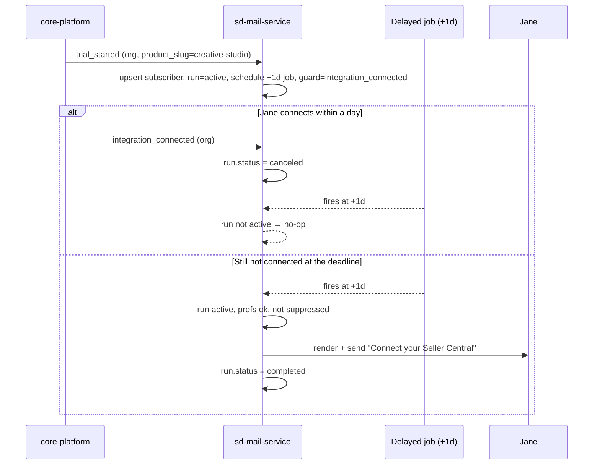
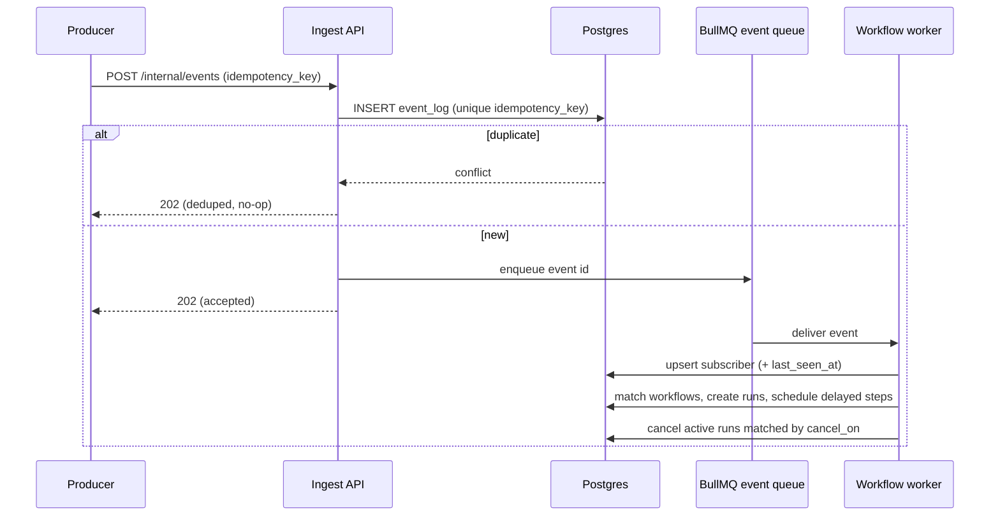
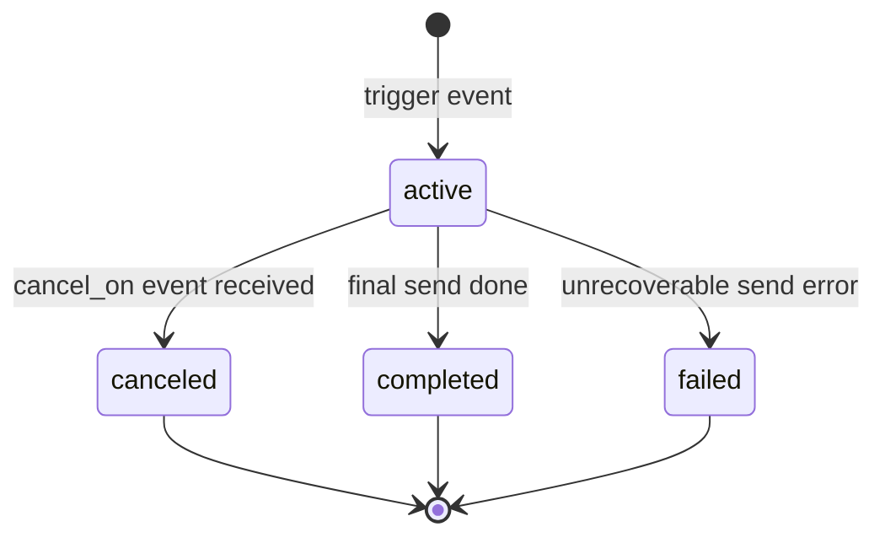
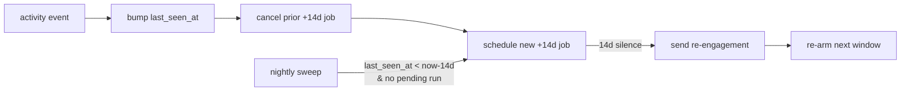

# 04 — Event & Workflow Model

This is the engine. It defines the **event contract**, the **workflow step vocabulary**, and the **schedule-and-cancel** mechanics with state machines and sequence diagrams.

## Workflow vs Version vs Run (read this first)

Three tables model automations. The mental model is **recipe → recipe edition → one cooked meal** (or **class → source revision → running instance**):

| Concept | Table | What it is | Analogy |
|---------|-------|-----------|---------|
| **Workflow** | `workflows` | The *definition/rule*: "when `trial_started`, wait 1 day, cancel if `integration_connected`, else send." Stable identity `(product, key)` + routing (`trigger_event_key`, `category`, `audience`, `enabled`) + a pointer to the live version (`active_version_id`). It does **not** store the steps directly. | the recipe |
| **Workflow version** | `workflow_versions` | One saved revision of that workflow's `steps` JSON. Editing in the admin UI creates a **new** version (v1, v2, v3…) and moves `active_version_id`. Gives a safe edit history + audit (`created_by`) + rollback. | a specific edition of the recipe |
| **Workflow run** | `workflow_runs` | One *execution* for **one subscriber**, started by **one trigger event**. Holds the live `status` (`active → canceled \| completed \| failed`), the `cancel_on` keys, and — crucially — **pins the `workflow_version_id`** it started on. Schedules `run_steps` and produces `messages`. | one time you actually cook it, for one guest |

**Why the split matters:** editing a workflow (new version) never disrupts journeys already in progress — a run keeps following the version it pinned, so only *new* runs use the edit. And the same workflow executes independently for thousands of subscribers, each run with its own status and timing. Example: workflow `no_integration_1d` has versions v1/v2/**v3 (active)**; Jane's run pins v3 and is `active`, Bob's run pins v3 but is `canceled` (he connected) — one definition, many independent runs.

## The event contract

A producer sends one endpoint for everything:

```http
POST /internal/events
X-Service-Key: <SD_MAIL_SERVICE_KEY>
Content-Type: application/json

{
  "product_slug": "creative-studio",
  "event_key": "trial_started",
  "idempotency_key": "trial_started:org_1",
  "occurred_at": "2026-07-07T10:00:00Z",
  "subscriber": {
    "external_id": "user_uuid",
    "email": "jane@acme.com",
    "name": "Jane Doe",
    "attributes": { "org_id": "org_1", "org_name": "Acme", "role": "owner" }
  },
  "data": {
    "trial_ends_at": "2026-07-21T10:00:00Z",
    "upgrade_link": "https://app.salesduo.com/billing/upgrade",
    "tutorial_link": "https://help.salesduo.com/creative-studio/start"
  }
}
```

- **`event_key`** — a fact name (e.g. `trial_started`); the product comes from `product_slug`. Matches workflow triggers and cancellation keys.
- **`idempotency_key`** — producer-chosen; unique per `(product, key)`. Retries are safe.
- **`subscriber`** — upserts the profile. Producers may send a thin version (just `external_id`) once the profile exists.
- **`data`** — free-form variables available to templates (`{{ data.upgrade_link }}`) and to workflow config.
- Response: `202 Accepted` with the `event_log` id. Processing is async → producers treat this as **fire-and-forget**.

An `activity` event (via `/internal/events`) bumps `last_seen_at` and drives inactivity re-arming — there are no separate subscribers/activity endpoints.

Full producer details: [08-integration-guide](08-integration-guide.md).

## Two ways to send: events (marketing) vs messages (transactional)

There are **two distinct paths**, and they exist because required mail and lifecycle mail have opposite needs:

| | **Events** (`POST /internal/events`) | **Messages** (`POST /internal/messages`) |
|---|---|---|
| For | Lifecycle / **marketing** nudges | Required / **transactional** mail (OTP, password reset, invitation, contact, share) |
| Mode | **Async** — enqueue, `202`, fire-and-forget | **Synchronous** — render + send inline, returns the delivery result |
| Drives | Workflows (delay / cancel_on / repeat) | Nothing — one immediate send of a named template |
| Recipient | A subscriber (audience-resolved) | An explicit `to` (may be a **raw email** with no subscriber) |
| Compliance | Respects preferences + all suppressions; has unsubscribe footer | **Bypasses** opt-outs + unsubscribe/complaint; honors **hard-bounce** only; **no** unsubscribe footer |

### Transactional (synchronous) send

```http
POST /internal/messages          (auth: X-Service-Key; body includes product_slug)
{
  "template_key": "login_otp",
  "to": { "email": "jane@acme.com", "name": "Jane", "external_id": "user_uuid" },  // external_id optional
  "data": { "otp": "123456", "expires_minutes": 5 },
  "idempotency_key": "otp:user_uuid:2026-07-07T10:00:00Z"        // optional; dedups retries
}
→ 200 { "message_id": "...", "status": "sent", "provider_message_id": "..." }
   or 4xx/5xx with an error the caller can surface (e.g. hard-bounced address, render error)
```

- A message's class = its **template's `type`**. `/internal/messages` requires a `type = transactional` template; workflow `send` steps reference `marketing` templates. The service rejects the mismatch (a transactional template can't be a workflow step, and `/internal/messages` won't send a marketing template). The **audience is the explicit `to`** — no `audience` resolution, no workflow.
- The caller **awaits** the result, so latency-sensitive flows (login/signup OTP) know immediately whether the mail went out.
- `external_id` is optional: if present, the send links to (and upserts) that subscriber; if absent (e.g. **signup OTP, no account yet**) the message is logged against `to_email` with `subscriber_id` null.
- The only gate is the **hard-bounce** suppression list — preferences, unsubscribes, and complaints are ignored so a user can never lose access to required mail. See [11-security-and-compliance](11-security-and-compliance.md).

## Workflow definition

A workflow is `(trigger_event_key)` → an ordered list of **steps**, stored as JSON in `workflow_versions.steps`:

```jsonc
// workflow: creative-studio / "no_integration_1d"
{
  "trigger_event_key": "trial_started",
  "category": "onboarding",
  "audience": "event_subscriber",
  "steps": [
    { "type": "delay",     "duration": "1d" },
    { "type": "cancel_on", "event_keys": ["integration_connected"] },
    { "type": "send",      "channel": "email", "template": "no_integration_1d" }
  ]
}
```

### Step types

| Step | Fields | Meaning |
|------|--------|---------|
| `send` | `channel`, `template`, `audience?` | Render the template and deliver. `template` is a template **`key`** (resolved against `templates` for this product + channel). Immediate if it's the first step; otherwise after preceding delays. |
| `delay` | `duration` (`1d`, `2d`, `14d`, `48h`, `until:<data.field>`) | Wait. `until:trial_ends_at` schedules to an absolute timestamp from event `data`. Admin-editable. |
| `cancel_on` | `event_keys[]` | For the remainder of the run, if any listed event arrives for this subscriber, cancel the run. |
| `repeat` | `every`, `until?` | Re-arm the workflow on a cadence (used for recurring inactivity). |

`cancel_on` is declarative and applies to the run from the point it's declared onward; in practice it's placed before the `send` it guards. Multiple `cancel_on` steps compose (their keys union).

**Audience precedence:** the workflow-level `audience` (`workflows.audience`) is the default recipient rule for all its sends; an individual `send` step's optional `audience` **overrides** it for that step only. Values: `event_subscriber` (the user on the triggering event) or `org_owner` (resolved from the subscriber's `attributes`).

### Trigger matching

On an ingested event, the engine finds every **enabled** workflow in that product whose `trigger_event_key` equals the event's `event_key`, and starts a run for each. One event can start several workflows (e.g. `trial_started` starts both *welcome* and *no-integration-1d*).

## Schedule-and-cancel mechanics

```
trigger event ─▶ create workflow_run (status=active)
                 walk steps:
                   send  (leading)  ─▶ deliver now
                   delay            ─▶ schedule BullMQ job at now+duration; record run_step
                   cancel_on        ─▶ note guard keys on the run
                 done walking (pending delayed job remains)

counter event ─▶ find active runs for this subscriber whose cancel_on matches ─▶ status=canceled

delayed job fires ─▶ reload run
                     if status != active           ─▶ no-op (log "canceled")
                     if prefs opted-out / suppressed ─▶ no-op (log "suppressed")
                     else                            ─▶ render + send; advance/complete run
```

### Sequence — "no integration after 1 day" (both branches)



### Sequence — event ingestion pipeline



## WorkflowRun state machine



## Recurring / inactivity (the `repeat` + re-arm pattern)

Email #6 ("no use in 2 weeks") is a **self-re-arming timer**:

1. Any `activity` (or `generation_completed`) event bumps `subscribers.last_seen_at` and **(re)schedules** the +14d inactivity send, **canceling** the previously scheduled one.
2. If 14 days pass with no activity, the send fires; then the workflow re-arms for the next window (via `repeat`).
3. A **nightly sweep** (scheduler) is a backstop: it finds subscribers with `last_seen_at < now - 14d` who have no pending inactivity run (e.g. onboarded before the feature shipped, or whose timer was never armed) and enqueues one.



## Immediate sends

A workflow whose first step is `send` (e.g. **welcome** on `trial_started`) delivers synchronously in the worker — no delay job. It still passes through preference/suppression checks and logs a `message`.

## Idempotency at every layer

| Layer | Guarantee | Mechanism |
|-------|-----------|-----------|
| Ingest | An event is processed once | `event_log (product_id, idempotency_key)` unique |
| Run creation | One run per (workflow, subscriber, trigger) | dedup on those keys before insert |
| Delivery | One message per send step | `messages` per `run_step`; delayed job re-checks before sending |
| Recurring | No pile-up of timers | re-arm cancels the prior job |

See [06-edge-cases-and-failure-modes](06-edge-cases-and-failure-modes.md) for the full matrix of tricky cases.
