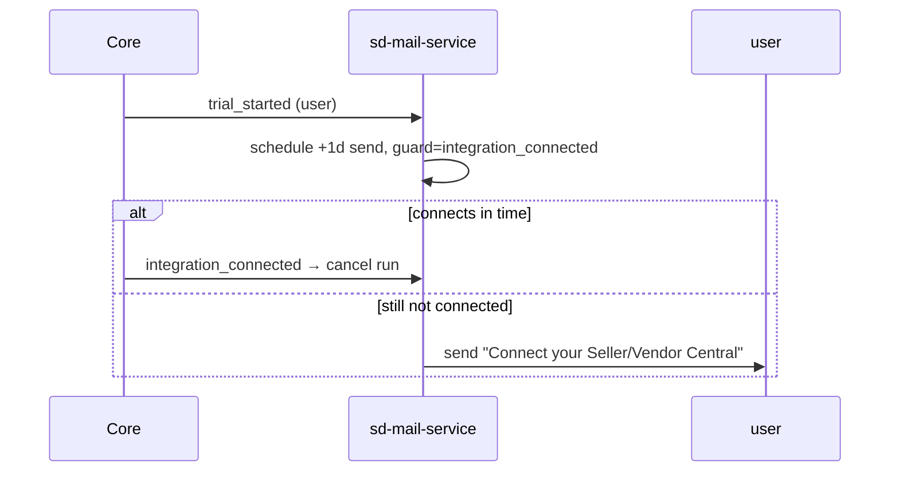
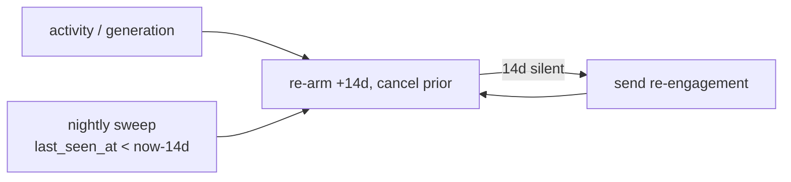

# 07 — Worked Example: AI Creative Studio

This maps the six requested Creative Studio lifecycle emails onto concrete sd-mail-service workflows: the trigger event, the steps, the recipient, which producer emits what, and the email copy (as the seed template body). This is the reference for how *any* product models its lifecycle emails.

## Product & producers

- **Product:** `creative-studio` (branding: brand color, logo, `from_email`, `reply_to_email`).
- **Events are fact-named** (`trial_started`, `integration_connected`, …) — not tool-prefixed; the product context comes from `product_slug: creative-studio` on each call.
- **Producers and the events they emit:**

| Event key | Emitted by | When |
|-----------|-----------|------|
| `trial_started` | core-platform | A trial/subscription for the Creative Studio tool begins (Stripe webhook path where `notifyTrialStarted` fires today) |
| `integration_connected` | core-platform | An `IntegrationAccount` for the org becomes `connected` |
| `generation_completed` | studio (optimizer) | A generation (image / A+ / SEO) finishes — the studio already consumes credits at these points |
| `activity` | studio | Any meaningful use (bumps `last_seen_at`) |
| `plan_purchased` | core-platform | Trial converts to paid |
| `trial_ended` | core-platform | A trial ends **without** converting (subscription-deleted webhook — auto period-end or manual cancel) |
| `checkout.initiated` / `checkout.completed` | core-platform billing | a plan Checkout Session is created / the checkout completes (Stripe) |

Recipient rules (per the locked decision): onboarding nudges → **the event's subscriber (the user)**; account-level nudges (trial ended, abandoned checkout) → **org owner** (resolved from `subscriber.attributes.org_*` or a dedicated owner subscriber).

Personalization: `{{ first_name }}` is derived from `subscriber.name` (first token); upstream identities generally carry only a full name.

---

## 1. Welcome (immediate)

- **Workflow** `welcome` · trigger `trial_started` · category `onboarding` · audience `event_subscriber`
- **Steps:** `[{ send: welcome }]`

```jsonc
{ "trigger_event_key": "trial_started",
  "steps": [ { "type": "send", "channel": "email", "template": "welcome" } ] }
```

- **CTA blocks:** primary → `{{ data.start_link }}` ("Start creating"), secondary → `{{ data.tutorial_link }}` ("Watch tutorial")
- **Body (seed):**

> Hi {{ first_name }},
>
> Welcome to SalesDuo's AI Creative Studio.
>
> You can now start creating Amazon compliant product creatives, SEO & AEO content directly by entering your ASINs.
>
> To get started:
> - Connect your Seller/Vendor Central account
> - Add a single ASIN or upload ASINs in bulk
> - Generate product images, premium A+ content and SEO & AEO listing content
>
> We've also added a quick tutorial to help you understand the full flow.
>
> Regards,
> Team SalesDuo

---

## 2. No integration after 1 day

- **Workflow** `no_integration_1d` · trigger `trial_started` · category `onboarding`
- **Steps:** `delay 1d` → `cancel_on integration_connected` → `send`

```jsonc
{ "trigger_event_key": "trial_started",
  "steps": [
    { "type": "delay", "duration": "1d" },
    { "type": "cancel_on", "event_keys": ["integration_connected"] },
    { "type": "send", "channel": "email", "template": "no_integration_1d" } ] }
```



- **CTAs:** primary → connect link ("Connect Seller Central"), secondary → setup tutorial
- **Body (seed):**

> Hi {{ first_name }},
>
> Your AI Creative Studio account is created, but your Seller/Vendor Central account is not connected yet.
>
> The integration is required because it helps us fetch your catalog details, reduce product and technical spec hallucinations and generate accurate creatives, SEO & AEO content. Once connected, you'll be able to start generating content for your ASINs.
>
> Regards,
> Team SalesDuo

---

## 3. Integration connected but no generation after 2 days

- **Workflow** `no_generation_2d` · trigger `integration_connected` · category `onboarding`
- **Steps:** `delay 2d` → `cancel_on generation_completed` → `send`

```jsonc
{ "trigger_event_key": "integration_connected",
  "steps": [
    { "type": "delay", "duration": "2d" },
    { "type": "cancel_on", "event_keys": ["generation_completed"] },
    { "type": "send", "channel": "email", "template": "no_generation_2d" } ] }
```

- **CTAs:** primary → generate link ("Generate your first listing"), secondary → generation tutorial
- **Body (seed):**

> Hi {{ first_name }},
>
> Your Seller Central account is connected. You're now ready to generate your first Amazon listing using AI Creative Studio.
>
> You can start with one ASIN or upload multiple ASINs in bulk to create product images, premium A+ content, SEO & AEO listing content.
>
> We've attached a quick tutorial to help you run your first generation.
>
> Regards,
> Team SalesDuo

---

## 4. Abandoned checkout after 1 day

- **Workflow** `abandoned_checkout_1d` · trigger `checkout.initiated` · category `billing` · audience `org_owner`
- **Steps:** `delay 1d` → `cancel_on checkout.completed` → `send`
- **Producer:** core billing emits `checkout.initiated` when a plan Checkout Session is created (plan checkouts only) and `checkout.completed` from the checkout-completed subscription webhook. Both are keyed by the Stripe session id. If the user finishes checkout within the day, `checkout.completed` cancels the nudge.

```jsonc
{ "trigger_event_key": "checkout.initiated",
  "steps": [
    { "type": "delay", "duration": "1d" },
    { "type": "cancel_on", "event_keys": ["checkout.completed"] },
    { "type": "send", "channel": "email", "template": "abandoned_checkout_1d" } ] }
```

- **CTA:** primary → complete-checkout link ("Complete checkout")
- **Body (seed):**

> Hi {{ first_name }},
>
> You're one step away from unlocking AI Creative Studio. Complete your checkout to start creating Amazon-ready creatives, premium A+ content and SEO/AEO listing content.
>
> Best,
> Team SalesDuo

---

## 5. Trial ended

- **Workflow** `trial_ended` · trigger `trial_ended` · category `billing` · audience `org_owner`
- **Steps:** `send` (immediate — event-driven, no timer/cancel)

```jsonc
{ "trigger_event_key": "trial_ended",
  "steps": [
    { "type": "send", "channel": "email", "template": "trial_ended" } ] }
```

Core emits the `trial_ended` fact when a trial actually ends **without converting** (auto period-end OR manual cancel — detected in the subscription-deleted webhook). The workflow just sends on that fact — no timer and no `plan_purchased` cancel, since a converted trial goes `trialing→active` and emits `plan_purchased` instead, so `trial_ended` is never emitted for it.

- **CTA:** primary → `{{ upgrade_link }}` ("Upgrade your account")
- **Body (seed):**

> Hi {{ first_name }},
>
> Your AI Creative Studio trial has now ended. You can continue with a paid plan to start creating Amazon ready product creatives, premium A+ content, Alexa for Shopping (Rufus) & COSMO optimized AEO and SEO listing content for your products.
>
> AI Creative Studio helps your team move faster without depending on long design cycles, multiple revision rounds or expensive creative support.
>
> Choose a plan and continue building your creative workflow here:
> {{ upgrade_link }}
>
> Best,
> Team SalesDuo

---

## 6. Inactive for 2 weeks

- **Workflow** `inactive_14d` · trigger `activity` (and `generation_completed`) · category `reengagement`
- **Steps:** `delay 14d` → `cancel_on activity` → `send` → `repeat`
- **Behavior:** each activity event re-arms the 14-day timer (canceling the prior); 14 days of silence fires the email; then it re-arms. A nightly sweep backstops users whose timer was never armed.



- **CTA:** primary → `{{ login_link }}` ("Continue creating")
- **Body (seed):**

> Hi {{ first_name }},
>
> We noticed you haven't used AI Creative Studio in the last 2 weeks.
>
> E-commerce discovery is changing fast. Product listings are no longer competing only on images and keywords — they now need to be ready for AI search, AEO, marketplace algorithms and shopping assistants that influence how buyers discover and compare products. That means static creatives and outdated listing content can quickly start falling behind.
>
> With AI Creative Studio, you can create Amazon ready product creatives, premium A+ content, Alexa for Shopping (Rufus) & COSMO optimized AEO and SEO listing content for your products.
>
> Now is a good time to come back, refresh your listings, and make sure your products are ready for the way shoppers are discovering products today.
>
> Continue creating:
> {{ login_link }}
>
> Best,
> Team SalesDuo

---

## What the producers must add

- **core-platform:** emit `trial_started` (at the existing `notifyTrialStarted` hook), `integration_connected` (when an `IntegrationAccount` becomes connected), `plan_purchased`, `trial_ended`, and `checkout.initiated`/`checkout.completed` (at Stripe Checkout Session creation / the checkout-completed webhook).
- **studio:** emit `generation_completed` and/or `activity` at generation flows (where credits are already consumed).

Everything else — timing, copy, CTAs, recipients, enable/disable — is admin-editable data in sd-mail-service. Adding a 7th email later means authoring a workflow + template; no product code changes unless a brand-new event source is needed.
