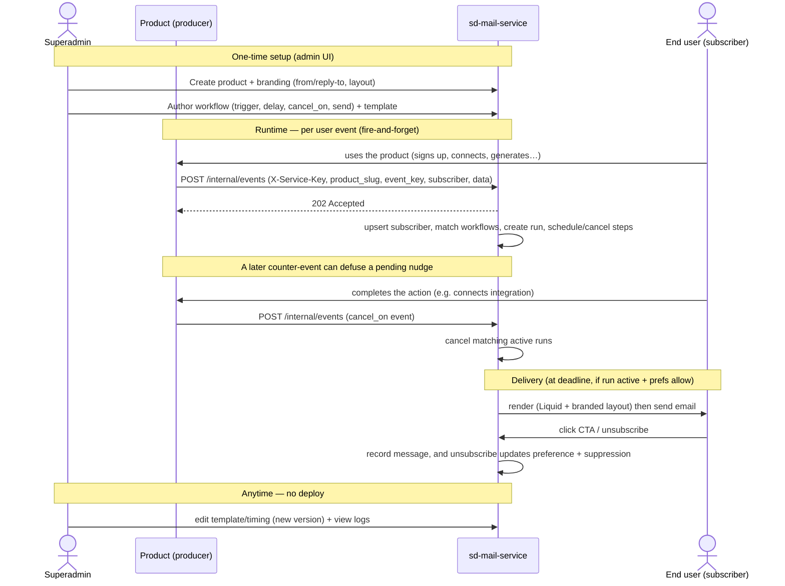
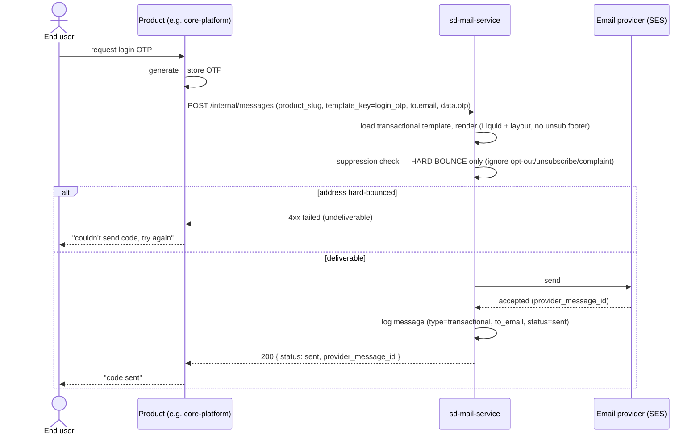

# 08 — Integration Guide (for Producers)

How a first-party product starts using sd-mail-service (**internal-only**). The contract is deliberately tiny: **emit events with the shared service key + a `product_slug`**. For copy-paste curl, see [`integration/http-examples.md`](integration/http-examples.md); for the concrete core/studio setup, the [`integration/*-migration.md`](integration/) runbooks.

## Usage at a glance

End-to-end usage across the actors — superadmin setup, producer runtime events, cancellation, delivery, and end-user engagement. (Source: [`diagrams/usage.mmd`](diagrams/usage.mmd).)



## 1. Get a product (no API key)

An sd-mail-service admin creates a `product` (branding, from/reply-to). There is **no per-product API key** — this is an internal-only service, so trusted first-party producers authenticate with one shared key. The producer stores `SD_MAIL_SERVICE_KEY` (= the service's `INTERNAL_API_KEY`) and the base URL (`SD_MAIL_URL`), and names the product per request via `product_slug`.

## 2. Auth

Every request carries the shared service key; the product is named in the body:

```
X-Service-Key: <SD_MAIL_SERVICE_KEY>
X-Service-Name: <your-service>        # optional, for logs
```

`product_slug` in the request body scopes the call to a product. (The old product-key `/v1/*` API has been removed.)

## 3. Emit events

```http
POST {SD_MAIL_URL}/internal/events
X-Service-Key: <SD_MAIL_SERVICE_KEY>
Content-Type: application/json

{
  "product_slug": "creative-studio",
  "event_key": "trial_started",
  "idempotency_key": "trial:org_1",
  "occurred_at": "2026-07-07T10:00:00Z",
  "subscriber": {
    "external_id": "org_1",
    "email": "owner@acme.com",
    "name": "Jane Doe",
    "attributes": { "org_name": "Acme", "role": "owner" }
  },
  "data": { "trial_ends_at": "2026-07-21T10:00:00Z" }
}
```

**Rules of thumb:**
- Always send an **`idempotency_key`** you can reproduce (safe retries).
- Send full `subscriber` on first touch; thin (`external_id` only) afterward.
- Put anything a template/workflow needs into `data`.
- Treat the call as **fire-and-forget** (don't block the user request on it).

There are no separate subscribers/activity endpoints — an `activity` event via `/internal/events` bumps `last_seen_at` and drives the inactivity workflow.

## 4. Clients (plain HTTP — no SDK package)

There is no published SDK; each producer has a small HTTP client that sends `X-Service-Key` + `product_slug`:
- **core-platform (TypeScript):** `backend/src/services/sd-mail.client.ts` — `sdMailClient.emitEvent(...)` / `.sendTransactional(...)`. Lifecycle facts are emitted from `services/mail-lifecycle.ts` (co-located with the existing `internal-notifier` billing hooks + the 3 integration-connect controllers).
- **studio / optimizer (Python):** `backend/app/services/sd_mail_client.py` + `services/creative_studio_events.py` — async httpx, swallow-and-log on failure (mirrors `SdInfraClient`).

Events are fire-and-forget; transactional sends are awaited (below).

### Transactional send (synchronous) — for required mail

For OTP, password reset, invitation, contact, and share invites the caller needs a **result** (the user is waiting, or the flow must roll back on failure). Use `POST /internal/messages` and **await** it — do not fire-and-forget.

```ts
// core-platform: sending a login OTP (product_slug defaults to 'core-platform' in the client)
const res = await sdMailClient.sendTransactional({
  templateKey: 'login_otp',
  to: { email: user.email, name: user.full_name, externalId: user.id },
  data: { otp, expires_minutes: 5 },
  idempotencyKey: `login_otp:${user.id}:${otpId}`,
});
if (res.status !== 'sent') {
  // surface to the user ("couldn't send code, try again"); do NOT proceed as if sent
}
```

```ts
// signup OTP: no account yet → omit externalId, send to a raw email
await sdMailClient.sendTransactional({ templateKey: 'signup_otp', to: { email }, data: { otp } });
```

Transactional sends **bypass** preferences + unsubscribe/complaint suppression (a user can't opt out of an OTP); they're blocked only by a prior **hard bounce**, which comes back as a failure the caller can surface. See [04](04-event-and-workflow-model.md#two-ways-to-send-events-marketing-vs-messages-transactional) and [11](11-security-and-compliance.md).

The synchronous transactional flow (source: [`diagrams/transactional-send.mmd`](diagrams/transactional-send.mmd)):



## 5. Idempotency & retries

- Producer retries with the **same** `idempotency_key` are safe — sd-mail-service dedups at ingest.
- SDKs retry transient failures locally with backoff; on exhaustion they log/DLQ. A dropped event degrades to "no nudge," never a product-facing error.

## 6. Choosing event keys

- **Fact-named** (e.g. `integration_connected`, `trial_started`) — not tool-prefixed; the **product** is supplied by `product_slug`.
- Keep them **stable** — workflows reference them by string.
- Emit **facts**, not intentions (`integration_connected`, not "send nudge"). sd-mail-service decides what to send. This keeps timing/conditions in the service, per [ADR-0002](adr/0002-schedule-and-cancel.md).

## 7. Migrating an existing email

Moving an email that a product sends today onto sd-mail-service is three steps:
1. **Create the template** in the admin UI under the product (set `type`: `transactional` for required/1:1 mail, `marketing` for lifecycle). Move the subject/body/branding out of the product's code/config.
2. **Replace the send call** — swap the product's direct SMTP / `sendMail` call for either `sendTransactional(...)` (await the result) or `emit(...)` (fire-and-forget lifecycle).
3. **Pass dynamic bits as `data`** — links the product builds (reset/invite URLs), codes, names. sd-mail-service needs no knowledge of the product's URLs.

The full cutover plan for the existing SalesDuo emails (core OTP/reset/invite/contact, studio share/batch, sd-buybox) — which template, which class, and which call site — is the migration table in [13-rollout-phases](13-rollout-phases.md#migration-of-existing-emails).

## 8. Reference

- **OpenAPI** spec published by the service (`/openapi.json`) — generate typed clients as needed.
- Event catalog per product is visible in the admin UI (workflow triggers + cancel keys), so producers know exactly which events matter.
