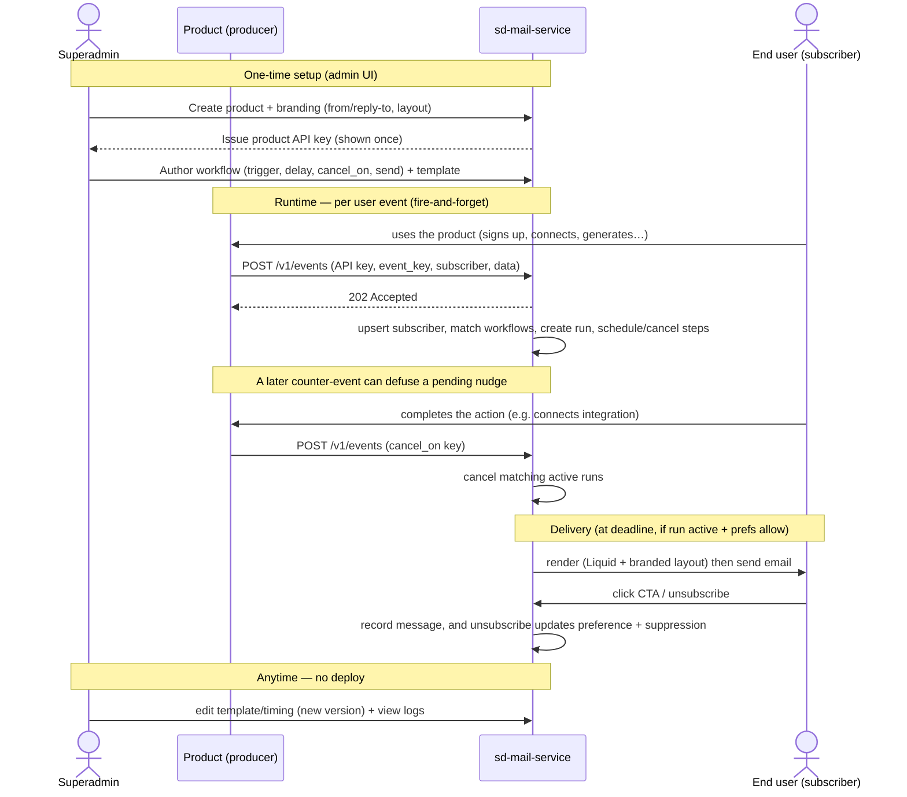

# 08 — Integration Guide (for Producers)

How a product starts using sd-mail-service. The contract is deliberately tiny: **get an API key, emit events**.

## Usage at a glance

End-to-end usage across the actors — superadmin setup, producer runtime events, cancellation, delivery, and end-user engagement. (Source: [`diagrams/usage.mmd`](diagrams/usage.mmd).)



## 1. Get a product + API key

An sd-mail-service admin creates a `product` (branding, from/reply-to) and issues an **API key** (shown once; stored hashed). The producer stores it as a secret (`SD_MAIL_SERVICE_API_KEY`), plus the base URL (`SD_MAIL_SERVICE_URL`).

## 2. Auth

Every request carries the key:

```
Authorization: Bearer <SD_MAIL_SERVICE_API_KEY>
# or
X-Api-Key: <SD_MAIL_SERVICE_API_KEY>
```

The key resolves to exactly one `product`; all data is scoped to it. Optional **HMAC signing** (`X-Signature: sha256=<hmac(body, secret)>`) hardens payload integrity for high-trust producers.

## 3. Emit events

```http
POST {SD_MAIL_SERVICE_URL}/v1/events
Authorization: Bearer <key>
Content-Type: application/json

{
  "event_key": "creative_studio.trial_started",
  "idempotency_key": "trial:sub_abc:2026-07-07",
  "occurred_at": "2026-07-07T10:00:00Z",
  "subscriber": {
    "external_id": "user_uuid",
    "email": "jane@acme.com",
    "name": "Jane Doe",
    "attributes": { "org_id": "org_1", "org_name": "Acme", "role": "owner" }
  },
  "data": { "trial_ends_at": "2026-07-21T10:00:00Z", "upgrade_link": "https://…" }
}
```

**Rules of thumb:**
- Always send an **`idempotency_key`** you can reproduce (safe retries).
- Send full `subscriber` on first touch; thin (`external_id` only) afterward.
- Put anything a template/workflow needs into `data`.
- Treat the call as **fire-and-forget** (don't block the user request on it).

Other endpoints:
- `POST /v1/subscribers` — identify/update a profile without triggering a workflow.
- `POST /v1/events/activity` — thin ping: `{ "external_id": "…" }` → bumps `last_seen_at` (drives inactivity).

## 4. SDKs

Thin wrappers over the REST API; both fire-and-forget with local retry.

### TypeScript (core-platform)

```ts
import { SdMailService } from '@salesduo/sd-mail-service';
const notify = new SdMailService({ url: process.env.SD_MAIL_SERVICE_URL, apiKey: process.env.SD_MAIL_SERVICE_API_KEY });

// at the existing notifyTrialStarted hook:
notify.emit('creative_studio.trial_started', {
  idempotencyKey: `trial:${sub.id}:${sub.trial_start}`,
  subscriber: { externalId: user.id, email: user.email, name: user.full_name,
                attributes: { org_id: org.id, org_name: org.name, role } },
  data: { trial_ends_at: sub.trial_end, upgrade_link, tutorial_link },
});
```

Mirror the existing `internal-notifier` emit sites in core (`webhook.controller.ts`, `billing.controller.ts`) — the same call sites that fire `billing.trial_started` today also `notify.emit(...)`. Add an `integration.connected` emit where `IntegrationAccount.status` flips to `connected`.

### Python (studio / optimizer)

```python
from sd_mail_service import SdMailService
notify = SdMailService(url=SD_MAIL_SERVICE_URL, api_key=SD_MAIL_SERVICE_API_KEY)  # async, fire-and-forget

# at a generation-complete point (where credits are already consumed):
await notify.emit(
    "creative_studio.generation.completed",
    idempotency_key=f"gen:{project_id}:{run_id}",
    subscriber={"external_id": user["id"], "email": user["email"], "name": user["full_name"]},
    data={"asin": asin},
)
```

Model it after the existing `SdInfraClient` / `send_notification_email` style in `app/services/platform_data.py` (async httpx client, swallow-and-log on failure).

## 5. Idempotency & retries

- Producer retries with the **same** `idempotency_key` are safe — sd-mail-service dedups at ingest.
- SDKs retry transient failures locally with backoff; on exhaustion they log/DLQ. A dropped event degrades to "no nudge," never a product-facing error.

## 6. Choosing event keys

- Namespace: `"<product>.<event>"` (e.g. `creative_studio.integration.connected`).
- Keep them **stable** — workflows reference them by string.
- Emit **facts**, not intentions ("integration.connected", not "send nudge"). sd-mail-service decides what to send. This keeps timing/conditions in the service, per [ADR-0002](adr/0002-schedule-and-cancel.md).

## 7. Reference

- **OpenAPI** spec published by the service (`/openapi.json`) — generate typed clients as needed.
- Event catalog per product is visible in the admin UI (workflow triggers + cancel keys), so producers know exactly which events matter.
