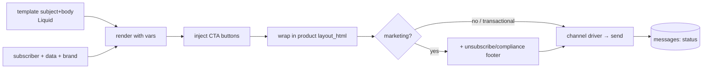

# 10 — Delivery & Channels

Delivery is behind a **channel-driver abstraction** so email ships first and other channels slot in later without schema or workflow changes.

## Channel-driver interface

```ts
interface ChannelDriver {
  channel: 'email' | 'slack' | 'in_app' | 'sms';
  send(rendered: RenderedMessage, subscriber: Subscriber, product: Product): Promise<DeliveryResult>;
}
```

- The workflow `send` step names a `channel` and a `template`; the engine renders, then dispatches to the matching driver.
- `messages` records the outcome (`provider_message_id`, `status`, `error`) regardless of channel.

## Email driver (v1)

- **Transport:** Nodemailer over SMTP, or Amazon SES (SES recommended in prod for deliverability, bounce/complaint webhooks, and scale). Config via env; per-`product` `from_email`/`reply_to_email`.
- **Rendering:**
  1. Render `subject` + `body` with **LiquidJS** using `{ subscriber, data, first_name, brand_* }`.
  2. Render CTA blocks (label + url) into branded buttons.
  3. Wrap in the product's `layout_html` (header/logo/footer).
  4. Append the compliance footer + unsubscribe link **only for `marketing` messages**. **Transactional** messages get no unsubscribe footer / `List-Unsubscribe` (they're exempt required mail).
- **Deliverability:** SPF/DKIM/DMARC on sending domains; dedicated/segmented IP or SES configuration set; `List-Unsubscribe` header on marketing mail.
- **Feedback loop:** SES/provider webhooks → ingest bounces/complaints → `suppressions` (see [11](11-security-and-compliance.md)).

## Message class gates the send (transactional vs marketing)

Both classes share the render pipeline but differ at the **send-time gate**:

| Check | `marketing` (workflow/events) | `transactional` (`/internal/messages`) |
|-------|-------------------------------|----------------------------------|
| Preference opt-out | blocks | **ignored** |
| Suppression: unsubscribe / complaint | blocks | **ignored** |
| Suppression: hard bounce | blocks | **blocks** (undeliverable) |
| Unsubscribe footer / `List-Unsubscribe` | added | **omitted** |
| Send mode | async (queued) | synchronous (result returned) |

So a user who unsubscribed from marketing still receives their OTP, but neither class mails a hard-bounced address. Rules live in [11-security-and-compliance](11-security-and-compliance.md).

## Rendering pipeline



## Why Liquid (not raw string replace, not a heavy engine)

- **Liquid** (Shopify's language, `liquidjs`) is designed for **untrusted, user-authored** templates: safe by default, supports the light logic admins need (``, filters like `{{ name | default: "there" }}`), and is familiar.
- It replaces core-platform's hand-rolled `{key}` `String.replace`, which has no escaping, defaults, or conditionals — inadequate once non-engineers author templates across products.
- A full templating framework (React email, MJML build steps) is deferred; MJML can be introduced later for responsive layouts behind the same render step.

## Multi-channel readiness (later)

| Channel | Driver notes |
|---------|-------------|
| **Slack** | Post to a channel/user via bot token; reuse the internal-Slack patterns already in core-platform. Template `body` becomes blocks/text. |
| **In-app** | Persist a notification row the product fetches; "delivery" = insert + optional push. |
| **SMS** | Twilio/SNS driver; template `body` becomes plain text; stricter length + opt-in rules. |

None of these require changing the workflow model — a workflow just gains a `send` step with a different `channel`. Preferences already key on `(category, channel)`, so opt-outs work per channel from day one.

## Idempotency & retries at delivery

- One `message` per `run_step`; a redelivered job checks for an existing successful message before sending → no double-send.
- Transient provider errors retry with backoff; exhausted → DLQ + alert; `message.status = failed` with the error.
