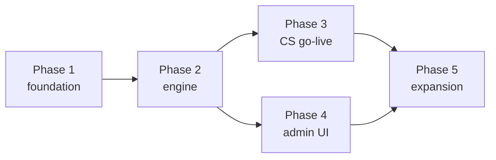

# 13 — Rollout Phases

A pragmatic path from empty repo to the Creative Studio emails live, then expansion. Each phase is shippable.

## Phase 1 — Foundation

**Goal:** ingest events and send one email.

- New repo `sd-mail-service`; process skeleton (api / worker / scheduler), Docker, CI/CD.
- Postgres schema + migrations for: `products`, `api_keys`, `subscribers`, `subscriber_preferences`, `event_log` ([03](03-data-model.md)).
- Ingest API (`/v1/events`, `/v1/subscribers`, `/v1/events/activity`) with API-key auth + idempotency + BullMQ enqueue.
- Subscriber upsert on events.
- Email driver (Nodemailer/SES) + Liquid renderer + product `layout_html` wrapper.
- **Exit:** emit an event → an immediate email sends (hard-coded single workflow) end-to-end in dev.

## Phase 2 — Workflow engine

**Goal:** declarative workflows with delays and cancellation.

- `workflows`, `workflow_versions`, `templates`, `workflow_runs`, `run_steps`, `messages`, `suppressions`.
- Workflow engine: trigger matching, run creation, step executor (`send`/`delay`/`cancel_on`/`repeat`).
- Scheduler: BullMQ delayed jobs + nightly sweep; cancellation path.
- Preferences + unsubscribe (signed tokens) + suppression enforcement at send.
- **Exit:** schedule-and-cancel proven — a delayed nudge fires only when its cancel event is absent; idempotency holds.

## Phase 3 — Creative Studio go-live

**Goal:** the real emails, live.

- Seed the `creative-studio` product + workflows #1, #2, #3, #5, #6 with the copy from [07](07-creative-studio-example.md).
- Wire producers:
  - core-platform (TS SDK): emit `trial_started`, `integration.connected`, `plan_purchased` at existing lifecycle points.
  - studio (Python SDK): emit `generation.completed` / `activity` at generation flows.
- Verify each of the 5 workflows end-to-end in staging.
- **Exit:** the five emails send correctly against real product events; cancellations work.

## Phase 4 — Admin UI

**Goal:** non-engineers control everything.

- Admin app: products/branding/keys, workflow editor, template editor + preview + send-test, subscribers, logs, superadmin auth ([09](09-admin-ui.md)).
- Migrate the seeded workflows/templates to be admin-managed.
- **Exit:** an admin edits copy/CTA/delay and toggles a workflow with no deploy; changes reflected in the next run.

## Phase 5 — Expansion

**Goal:** breadth.

- **Abandoned checkout (#4):** add `checkout.initiated`/`checkout.completed` hooks at Stripe Checkout Session creation in core billing; author the workflow.
- **Onboard new products:** early-reviews, affiliates — create products, keys, workflows; they emit events. No engine changes.
- **Migrate existing emails:** move core's transactional (OTP, reset, invitation) and the studio's share-invite emails onto sd-mail-service templates where it makes sense.
- **Add channels:** Slack / in-app / SMS drivers behind the existing `send` step.
- **Nice-to-haves:** hosted preference center, event replay tooling, per-subscriber timezone send windows.

## Dependencies & sequencing

Phase 4 can proceed in parallel with Phase 3 once the engine (Phase 2) exists — go-live can seed workflows directly while the admin UI is built.

## Definition of done (v1)

- The 5 in-scope Creative Studio emails send correctly, respect cancellation, are idempotent, and are admin-editable.
- Preferences/unsubscribe/suppression enforced.
- Producers (core + studio) emit via SDKs; a dropped emit never breaks a product.
- Observability: logs, metrics, alerts, DLQ in place.
