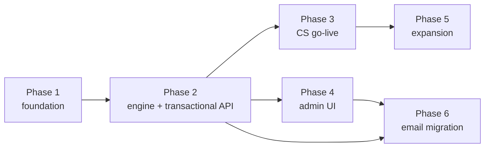

# 13 — Rollout Phases

A pragmatic path from empty repo to the Creative Studio emails live, then expansion. Each phase is shippable.

## Phase 1 — Foundation

**Goal:** ingest events and send one email.

- New repo `sd-mail-service`; process skeleton (api / worker / scheduler), Docker, CI/CD.
- Postgres schema + migrations for: `products`, `subscribers`, `subscriber_preferences`, `event_log` ([03](03-data-model.md)).
- Ingest API (`POST /internal/events`) with shared-service-key auth + `product_slug` + idempotency + BullMQ enqueue.
- Subscriber upsert on events.
- Email driver (Nodemailer/SES) + Liquid renderer + product `layout_html` wrapper.
- **Exit:** emit an event → an immediate email sends (hard-coded single workflow) end-to-end in dev.

## Phase 2 — Workflow engine

**Goal:** declarative workflows with delays and cancellation.

- `workflows`, `workflow_versions`, `templates`, `workflow_runs`, `run_steps`, `messages`, `suppressions`.
- Workflow engine: trigger matching, run creation, step executor (`send`/`delay`/`cancel_on`/`repeat`).
- Scheduler: BullMQ delayed jobs + nightly sweep; cancellation path.
- **Transactional send:** synchronous `POST /internal/messages` + the class-aware gate (transactional bypasses opt-out/unsubscribe/complaint, honors hard bounce, no footer). `messages.type`/`to_email`, nullable `subscriber_id`.
- Preferences + unsubscribe (signed tokens) + suppression enforcement at send.
- **Exit:** schedule-and-cancel proven — a delayed nudge fires only when its cancel event is absent; idempotency holds. A transactional send to an unsubscribed address is delivered; to a hard-bounced address is blocked.

## Phase 3 — Creative Studio go-live

**Goal:** the real emails, live.

- Seed the `creative-studio` product + workflows #1, #2, #3, #5, #6 with the copy from [07](07-creative-studio-example.md).
- Wire producers:
  - core-platform (TS client): emit `trial_started`, `integration_connected`, `plan_purchased`, `trial_ended` at existing lifecycle points.
  - studio (Python client): emit `generation_completed` / `activity` at generation flows.
- Verify each of the 5 workflows end-to-end in staging.
- **Exit:** the five emails send correctly against real product events; cancellations work.

## Phase 4 — Admin UI

**Goal:** non-engineers control everything.

- Admin app: products/branding, workflow editor, template editor + preview + send-test, subscribers, campaigns, logs, superadmin auth ([09](09-admin-ui.md)).
- Migrate the seeded workflows/templates to be admin-managed.
- **Exit:** an admin edits copy/CTA/delay and toggles a workflow with no deploy; changes reflected in the next run.

## Phase 5 — Expansion

**Goal:** breadth.

- **Abandoned checkout (#4):** ✅ **done** — core billing emits `checkout.initiated` at Stripe Checkout Session creation and `checkout.completed` from the checkout-completed webhook; the `abandoned_checkout_1d` workflow + template are provisioned and enabled.
- **Onboard new products:** early-reviews, affiliates — create products, keys, workflows; they emit events. No engine changes.
- **Add channels:** Slack / in-app / SMS drivers behind the existing `send` step.
- **Nice-to-haves:** hosted preference center, event replay tooling, per-subscriber timezone send windows.

## Phase 6 — Migration of existing emails

**Goal:** make sd-mail-service the **single email egress** for the platform and retire core's SMTP path. Requires the transactional API (Phase 2).

Every email SalesDuo sends today, where it goes:

| Email | Today (call site) | sd-mail-service template (product) | Class | Send path |
|-------|-------------------|-----------------------------------|-------|-----------|
| Login OTP | core `auth.controller.ts:692` | `login_otp` (core-platform) | transactional | `sendTransactional` (await) |
| Signup/verify OTP | core `auth.controller.ts:826` | `signup_otp` (core-platform) | transactional | `sendTransactional` — raw email, no subscriber |
| Password reset | core `auth.controller.ts:442` | `password_reset` (core-platform) | transactional | `sendTransactional` (link in `data`) |
| Org invitation | core `invitation.service.ts:75` | `invitation` (core-platform) | transactional | `sendTransactional`; invite rolls back on non-`sent` |
| Contact-us → support | core `contact.controller.ts:24` | `contact_notify` (core-platform) | transactional | `sendTransactional` to support inbox |
| Project / SEO / batch share invite | studio `sharing.py:213`, `seo_sharing.py:224`, `batch_sharing.py:324` | `share_invite_*` (creative-studio) | transactional (1:1) | `sendTransactional` from studio directly |
| Batch-complete | studio `bulk_batch_creative_tasks.py:774` | `batch_complete` (creative-studio) | transactional | `sendTransactional` (or `emit` if made unsubscribable) |
| sd-buybox alerts | buybox `corePlatform.client.ts:174` | buybox templates | per email | repoint to sd-mail-service |

**Steps:**
1. Author the templates above in the admin UI; move subjects/branding out of core's `system_configs` (`email_subject_*`, `brand_*`) into product config + templates.
2. Repoint each call site: core (`auth`/`invitation`/`contact`) → `sendTransactional`; studio `send_notification_email` / `SdInfraClient.send_email` and sd-buybox client → sd-mail-service base URL. Reset/invite **links stay producer-built and passed as `data`**.
3. Cut over behind a flag; verify each email in staging.
4. **Retire** core's `mail.service.ts`, `email-templates.ts`, `email_subject_*` config, and `POST /internal/email/send` (optionally a thin proxy → sd-mail-service during transition, then remove). Move `SMTP_*` env to sd-mail-service.
- **Exit:** no email uses core SMTP; `/internal/email/send` retired; unsubscribing from marketing never blocks OTP/reset.

## Dependencies & sequencing

Phase 4 can proceed in parallel with Phase 3 once the engine (Phase 2) exists. Phase 6 (migration) needs the transactional API (Phase 2) and the admin UI (Phase 4) to author templates.

## Definition of done (v1)

- The 5 in-scope Creative Studio emails send correctly, respect cancellation, are idempotent, and are admin-editable.
- Transactional send API works; transactional mail bypasses opt-out/unsubscribe but honors hard bounce; no unsubscribe footer on it.
- Preferences/unsubscribe/suppression enforced for marketing.
- Producers (core + studio) emit via their small HTTP clients; a dropped **event** never breaks a product (transactional sends surface failures to the caller).
- Observability: logs, metrics, alerts, DLQ in place.
