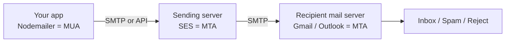
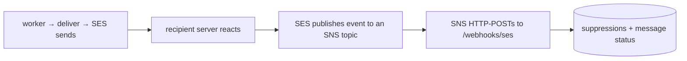

# 15 — Email Fundamentals (and the SES/SNS feedback loop)

A from-first-principles primer on how email actually works, the deliverability concepts every mail system must respect, and a deep dive on the **SES → SNS bounce/complaint webhook** this service implements. Read this to understand *why* the code is shaped the way it is — most of it falls out of one fact: **you don't control the last hop, and you find out what happened asynchronously.**

## 1. How email works (the delivery chain)

Email is a **store-and-forward relay system**. "Sending" hands a message through a chain of servers until the recipient's mailbox provider decides to accept, spam-folder, or reject it — often minutes or hours later.

Vocabulary:
- **SMTP** — *Simple Mail Transfer Protocol*, the language mail servers speak. Ports: 25 (server↔server), 587/465 (authenticated app→server). This service's `SMTP_HOST`/`SMTP_PORT` point at one of these.
- **MTA** — *Mail Transfer Agent*, a relay server (SES; Gmail's servers).
- **MUA** — *Mail User Agent*, the client that composes/sends. Here it's **Nodemailer** (`backend/src/services/delivery/email-driver.ts`).

The consequence of the async last hop: sending success only means "the provider accepted it for delivery," **not** "it reached the inbox." Bounce/complaint feedback arrives later, out of band — which is the entire reason SNS exists in this design.

## 2. Two ways to send, and the driver abstraction

1. **Run your own MTA** — impractical: IP reputation, blocklists, scaling, DNS.
2. **Use a provider** (MTA-as-a-service): Amazon **SES**, SendGrid, Mailgun, Postmark.

This service abstracts the transport behind one **channel driver** (`email-driver.ts`): dev uses plain SMTP → **Mailhog** (a local fake inbox); prod uses SES. `EMAIL_TRANSPORT` picks. The sending code (`deliver()` in `send.service.ts`) never knows which — only config changes.

## 3. SES — the sender

**SES = Simple Email Service**, AWS's email-sending product. You hand it a message (via the AWS SDK `@aws-sdk/client-ses`, or its SMTP interface) and it delivers to the recipient's provider. Why SES in prod:
- **Deliverability** — warmed IPs with good reputation, so mail lands in inboxes.
- **Scale** — bulk sends (campaigns) without managing connections.
- **Feedback** — it reports what happened to each message (delivered / bounced / complained). That feedback is delivered via SNS.

## 4. SNS — the reporter, and the feedback loop

**SNS = Simple Notification Service**, AWS's pub/sub system: a **publisher** sends to a **topic**, and **subscribers** get pushed each message. SES uses it to tell you about delivery events.

So: **SES sends; SNS reports back.** Two AWS services, two jobs. The webhook that receives step 4 is `POST /webhooks/ses` (§9).

## 5. Bounces, complaints, and sender reputation

The single most important operational concept. Two kinds of bad news come back:

- **Bounce** — undeliverable.
  - **Hard bounce** (SES: `Permanent`) — address/domain doesn't exist. Never works. → **suppress; never resend.**
  - **Soft bounce** (SES: `Transient`) — temporary (mailbox full, server down). → retry OK; **do not suppress.**
- **Complaint** — the recipient hit **"mark as spam."** Very damaging. → **suppress immediately.**

Why you *must* process these — **reputation**:
- Mailbox providers score your **bounce rate** and **complaint rate**. Too high → your mail (for the whole sending domain) gets spam-foldered or rejected.
- **SES suspends accounts** above roughly **>5% bounce** or **>0.1% complaint**. That would take down OTP/login mail platform-wide.

This is why the **suppression list** exists: `suppressions` table + `suppression.service.ts`. On a hard bounce/complaint, `addSuppression()` records it; every `deliver()` calls `checkSuppression()` first. The SES webhook (§9) is what feeds this list automatically in production — without it, bounces/complaints are invisible and reputation silently rots.

## 6. Authentication: SPF, DKIM, DMARC

DNS records that prove you may send as your domain (anti-spoofing). Without them, mail goes to spam. Configure once per sending domain (DNS + SES):

- **SPF** (*Sender Policy Framework*) — DNS record listing which servers may send for the domain. *Who can send.*
- **DKIM** (*DomainKeys Identified Mail*) — SES cryptographically signs each message; the receiver verifies against your DNS public key. *Proof it wasn't forged/altered.*
- **DMARC** (*Domain-based Message Authentication, Reporting & Conformance*) — policy tying SPF+DKIM together, telling receivers what to do on failure (`none`/`quarantine`/`reject`) and where to send reports. *What to do if the above fail.*

These are **infrastructure/DNS**, not application code — but you own knowing they must exist before SES go-live.

## 7. Message classes: transactional vs marketing

Not all mail is equal, and the law treats them differently. This service is **class-aware** in `deliver()`:

| | Transactional | Marketing |
|---|---|---|
| Trigger | a user action (OTP, reset, receipt, invite) | you decide to send (campaign, nudge) |
| Unsubscribe | not required (exempt) | legally required |
| Opt-out / unsubscribe / complaint suppression | **ignored** | **honored** |
| Hard-bounce suppression | **honored** (dead address is dead) | honored |
| Footer / `List-Unsubscribe` | omitted | added |
| Send mode | synchronous (`/internal/messages`) | async (queued) |

The payoff: a user who unsubscribed from marketing still receives their password reset, but no class ever mails a hard-bounced address. See [10-delivery-and-channels](10-delivery-and-channels.md) and [11-security-and-compliance](11-security-and-compliance.md).

## 8. Compliance (the legal layer)

- **CAN-SPAM** (US) — marketing needs a working unsubscribe (honored ≤10 days), a physical address, honest headers. Transactional exempt.
- **GDPR / CASL** (EU / Canada) — consent to market; right to be forgotten.
- Mechanically: the signed unsubscribe link (`/u/:token`, `unsubscribe-token.ts`), per-category **preferences**, and the **suppression** list.

## 9. Deep dive — the SES/SNS bounce/complaint webhook

This is the "feedback loop" made real. Files: `services/delivery/sns.ts`, `controllers/webhooks.controller.ts` (`postSesFeedback`), the route in `app.ts`, and `tests/sns.test.ts`.

### Why it's security-sensitive
The endpoint is public (SNS calls it from AWS, unauthenticated by any shared key — SNS can't attach one). If we trusted any POST, an attacker could forge bounce/complaint events and **suppress arbitrary addresses** (a denial-of-service on your own mail). So the **SNS signature IS the authentication**. Getting verification right is the whole game.

### The SNS message envelope
Each POST body is JSON with a `Type` of `SubscriptionConfirmation`, `Notification`, or `UnsubscribeConfirmation`, plus `MessageId`, `TopicArn`, `Message`, `Timestamp`, `Signature`, `SignatureVersion`, `SigningCertURL`, and (for confirmations) `Token` + `SubscribeURL`. Note SNS sends `Content-Type: text/plain` with a JSON string body — so the route is mounted with `express.text()` **before** `express.json()` (`app.ts`).

### Signature verification (`verifySnsSignature`)
Four steps, each a real defense:

1. **Validate the `SigningCertURL` host** (`isValidSigningCertUrl`). It must be `https://sns.<region>.amazonaws.com`. Without this check, an attacker sends a message whose "cert" URL points at *their* server, hands us a public key they control, and every forged signature verifies. The host allowlist (regex `^sns\.[a-z0-9-]+\.amazonaws\.com(\.cn)?$`) also blocks **SSRF** (tricking our server into fetching arbitrary URLs).
2. **Rebuild the exact bytes SNS signed** (`canonicalString`). SNS signs a specific, ordered subset of fields as `key\nvalue\n` per field. The order and field set differ by message type:
   - `Notification`: `Message, MessageId, Subject?, Timestamp, TopicArn, Type` (Subject only if present).
   - `SubscriptionConfirmation` / `UnsubscribeConfirmation`: `Message, MessageId, SubscribeURL, Timestamp, Token, TopicArn, Type`.
   A single wrong byte → verification fails, so this is unit-tested.
3. **Fetch the AWS signing certificate** (cached per URL) and **verify** with Node `crypto`: `RSA-SHA1` for `SignatureVersion: '1'`, `RSA-SHA256` for `'2'`, over the canonical string, against the base64 `Signature`.
4. Any failure → the handler returns **403** and nothing is suppressed.

We hand-rolled this (≈70 lines, no dependency) to match the codebase's lean style; the security-critical pieces (cert-URL allowlist, canonical string) have unit tests in `tests/sns.test.ts`.

### The subscription handshake
Before sending events, SNS sends a one-time `SubscriptionConfirmation` containing a `SubscribeURL`. The endpoint must GET that URL to activate the subscription (`confirmSubscription`). Optionally, `SES_SNS_TOPIC_ARN` pins the endpoint to a single topic so it won't confirm subscriptions from unexpected topics.

### From event to suppression (`parseSesNotification` → `suppressForFeedback`)
- Parse the inner SES event (`SnsMessage.Message` is itself a JSON string). Map **`Bounce` + `bounceType: Permanent` → `hard_bounce`** and **`Complaint` → `complaint`**; ignore transient bounces and deliveries.
- **Scope to a product.** Suppressions are per `(product_id, email)`, but SES events don't carry your product id. We look up the originating `messages` row by the SES message id (`provider_message_id`), and fall back to any product that recently mailed the address — so a dead address gets suppressed everywhere it was used. Then `addSuppression()` + flag the recent `messages` as `bounced`/`complained` (reusing the same helper the normalized `/webhooks/email` path uses).
- Always return **200** for a verified, well-formed event so SNS doesn't retry endlessly.

### Wiring it up in production (infra, no code)
1. Create an SNS topic for SES bounce/complaint (and optionally delivery) notifications.
2. In SES, set the identity's/configuration-set's feedback destination to that topic.
3. Subscribe the HTTPS endpoint `https://<host>/webhooks/ses` to the topic.
4. Set `SES_SNS_TOPIC_ARN` to the topic ARN. SNS sends the confirmation (auto-confirmed), then feedback flows into `suppressions` automatically.

## 10. How this system is architected (anatomy → code)

A production mail platform, mapped to this repo:

1. **Decouple producers from sending** — products emit events; the service owns templates/timing/delivery (`/internal/events` + engine).
2. **Two send paths** — async queued (lifecycle) vs synchronous (transactional, returns result): `/internal/events` vs `/internal/messages`.
3. **Idempotency** so retries never double-send (unique `messages.run_step_id` / `(campaign, subscriber)`).
4. **Safe templating** for non-engineers (Liquid; see the in-admin variable reference).
5. **One delivery choke-point** applying the class-aware gate, render, send, record (`deliver()`).
6. **Feedback loop → suppression** (this doc, §5/§9).
7. **Compliance** — preferences, unsubscribe, suppression.
8. **Observability & reliability** — structured logs (Winston), retries with backoff (BullMQ); see [12-observability-and-ops](12-observability-and-ops.md).
9. **Multi-tenancy** — per-product branding, keys, scoping.

## 11. Acronym glossary

| Term | Meaning |
|------|---------|
| SMTP | Simple Mail Transfer Protocol — how mail servers exchange messages |
| MTA / MUA | Mail Transfer Agent (relay server) / Mail User Agent (client) |
| SES | Amazon Simple Email Service — the sender |
| SNS | Amazon Simple Notification Service — pub/sub; delivers SES feedback |
| Bounce (hard/soft) | Undeliverable; permanent (suppress) vs transient (retry) |
| Complaint | Recipient marked the mail as spam (suppress) |
| Suppression list | Addresses we must not mail, with a reason |
| Reputation | Provider's trust score for your sending domain/IP |
| SPF / DKIM / DMARC | DNS auth: who can send / proof of integrity / failure policy |
| Transactional vs marketing | Exempt required mail vs promotional (unsubscribe required) |
| List-Unsubscribe | Header letting clients offer one-click unsubscribe (marketing) |

## 12. Known gaps / further reading

- **SPF/DKIM/DMARC** on the real sending domain — infra to complete at SES go-live.
- **Producer wiring** (emit events / route existing emails here) — cross-repo, see [13-rollout-phases](13-rollout-phases.md).
- **Orphaned-`run_steps` recovery** after a Redis loss — a durability follow-up noted in [12-observability-and-ops](12-observability-and-ops.md).
